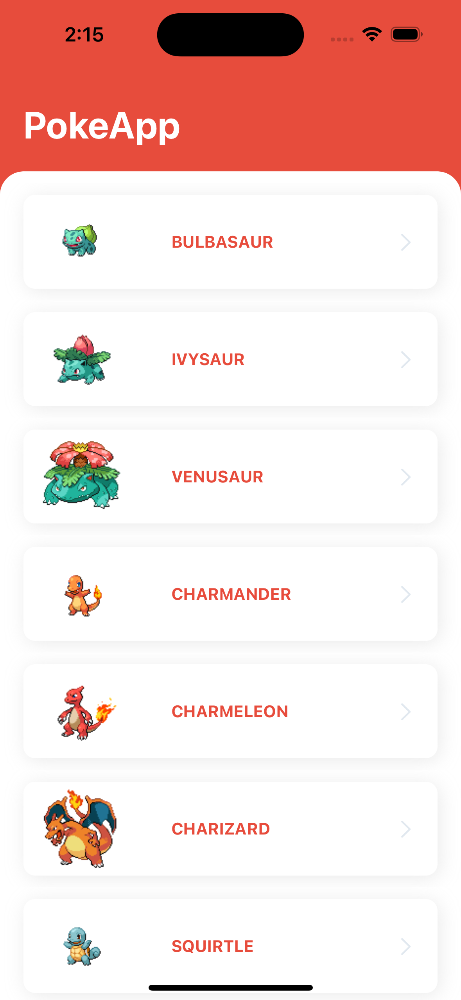
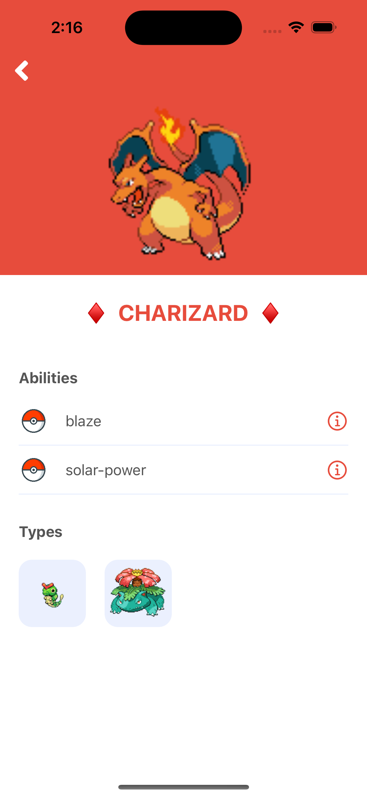

<!-- PROJECT LOGO -->
<br />
<div align="center">
  <h1 align="center">PokeApp</h1>
  <p align="center">Application that lists Pokemon and contains detail information</p>
</div>

<!-- TABLE OF CONTENTS -->
<summary>Table of Contents</summary>
<ol>
  <li><a href="#about-the-project">About The Project</a></li>
  <li><a href="#about-the-project">Screenshots</a></li>
  <li><a href="#built-with">Built With</a></li>
  <li>
    <a href="#getting-started">Getting Started</a>
    <ul>
      <li><a href="#prerequisites">Prerequisites</a></li>
      <li><a href="#installation">Installation</a></li>
    </ul>
  </li>
</ol>
<br />


<!-- ABOUT THE PROJECT -->
## About The Project

When the application is started, firstly, a screen with the pictures and names of the Pokemon is displayed. There is a scroll pagination on this screen. Each request brings 20 Pokemon data.

By pressing any Pokemon from this screen, the screen will be displayed where the detail data of that Pokemon will be displayed. This detail screen contains information showing the Pokemon's picture, name and abilities, as well as its resemblance to other Pokemon. When you press each skill, the description of that ability will appear as a warning above.
At the same time, by pressing other Pokemon pictures from this screen, it is possible to switch to their detail screens.

The application is built using the MVVM programming architecture.
Closures provide communication between the ViewModel and the Controller. With the help of this closure, ViewModel hasr gives the Controller what it needs to do with the help of event. Each ViewModel updates the Model related to the requests from the Controller and carries new data to the Controller.

Coordinator layer has been created for the transition between screens. Each Controller can communicate with its own Coordinator object as well as Coordinators can communicate with delegates among themselves.

Providers have been added to fulfill the responsibilities of TableView and CollectionView structures in the Controller in the application. Each provider performs the TableView or CollectionView operations it is responsible for and notifies the Controller with the help of an event.

The Alomafire library was used for service requests in the application.

Kingfisher library was used for downloading and caching images.

PromiseKit library was used for asynchronous programming.

<p align="right">(<a href="#readme-top">back to top</a>)</p>


<!-- SCREENSHOTS -->
## Screenshots

<div>
        
</div>
<br />

<p align="right">(<a href="#readme-top">back to top</a>)</p>


<!-- BUILD WITH -->
## Built With

* Swift, UIKit
* Alomafire - Network requests
* Kingfisher - Image download and caches
* PromiseKit - Asynchronous programming

<p align="right">(<a href="#readme-top">back to top</a>)</p>


<!-- GETTING STARTED -->
## Getting Started

In order to run the application, the following steps must be followed.

### Prerequisites

The app's dependencies must be installed with CocoaPods. Therefore, CocoaPods must be installed on your local computer. The current Xcode version is required to run the project.

* CocoaPods installation on terminal
  ```sh
  sudo gem install cocoapods
  ```

### Installation

1. Clone the repo
   ```sh
   git clone https://github.com/oktaytan/PokeApp.git
   ```
2. Install Pods packages
   ```sh
   pod install
   ```
3. Run project with Xcode

<p align="right">(<a href="#readme-top">back to top</a>)</p>
